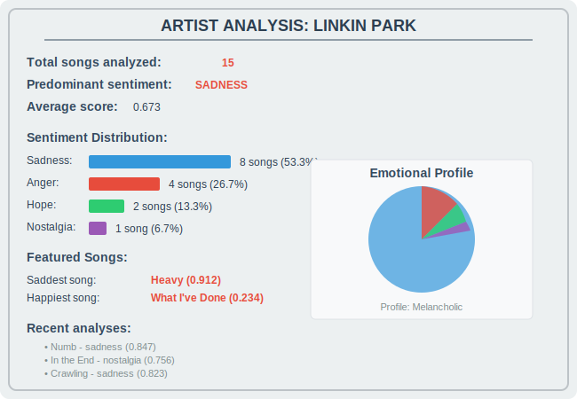

# MusicMood Analyzer

Sistema de Análise de Sentimento em Letras de Música que identifica automaticamente as emoções transmitidas pelas letras musicais usando processamento de linguagem natural (NLP).

## Funcionalidades

- **Busca automática de letras**: Obtém letras de músicas de múltiplas fontes online
- **Análise de sentimento avançada**: Utiliza NLP para identificar emoções predominantes
- **Detecção de múltiplas emoções**: Identifica sentimentos primários e secundários
- **Análise contextual**: Considera o contexto das frases e palavras intensificadoras
- **Banco de dados SQLite**: Armazena resultados para consultas futuras
- **Interface de linha de comando**: Múltiplos modos de uso (interativo, direto, análise de artista)
- **Estatísticas de artista**: Análise completa do perfil emocional de um artista

## Instalação

### Pré-requisitos

- Python 3.11 ou superior
- uv (gerenciador de pacotes Python)

### Configuração do ambiente

```bash
# Clone o repositório
git clone https://github.com/digomes87/musicmood-analyzer
cd musicmood-analyzer

# Crie e ative o ambiente virtual
uv venv .venv
source .venv/bin/activate  # No Windows: .venv\Scripts\activate

# Instale as dependências
uv pip install -e .
```

## Uso

### 1. Análise de Música Específica

```bash
# Análise básica
python main.py "Numb" "Linkin Park"

# Forçar nova análise (ignora cache)
python main.py "Numb" "Linkin Park" --force-refresh

# Saída em formato JSON
python main.py "Numb" "Linkin Park" --json
```

**Exemplo de saída:**


*Análise detalhada mostrando sentimento primário (Tristeza), secundário (Raiva), pontuação de confiança e distribuição de emoções detectadas.*

#### Formato JSON

Para integração com outras aplicações, use a flag `--json`:


*Formato estruturado JSON contendo todos os dados da análise, ideal para integração programática e processamento automatizado.*

### 2. Análise Completa de Artista

```bash
# Análise de todas as músicas de um artista
python main.py --artist "Linkin Park"
```

**Exemplo de saída:**



*Análise completa do perfil emocional do artista, mostrando distribuição de sentimentos, estatísticas e músicas mais representativas.*

### 3. Modo Interativo

```bash
# Inicia o modo interativo
python main.py --interactive
# ou simplesmente
python main.py
```

**Interface interativa:**


*Interface de terminal mostrando o fluxo completo do modo interativo, desde a seleção de opções até a exibição dos resultados da análise.*

## Estrutura do Projeto

```
musicmood-analyzer/
├── src/
│   ├── __init__.py
│   ├── musicmood.py          # Classe principal do sistema
│   ├── sentiment_analyzer.py # Motor de análise de sentimento
│   ├── lyrics_fetcher.py     # Buscador de letras online
│   └── database.py           # Gerenciador do banco SQLite
├── main.py                   # Interface de linha de comando
├── pyproject.toml           # Configuração e dependências
├── README.md                # Este arquivo
└── musicmood.db            # Banco de dados SQLite (criado automaticamente)
```

## Tecnologias Utilizadas

- **Python 3.11+**: Linguagem principal
- **NLTK**: Processamento de linguagem natural
- **TextBlob**: Análise de sentimento
- **BeautifulSoup4**: Web scraping para busca de letras
- **Requests**: Requisições HTTP
- **SQLite3**: Banco de dados local
- **LyricsGenius**: API para busca de letras (opcional)

## Algoritmo de Análise

O sistema utiliza uma abordagem multi-camada para análise de sentimento:

### 1. Análise Lexical
- Dicionários de palavras-chave emocionais em português e inglês
- Detecção de intensificadores ("muito", "extremely", etc.)
- Normalização e limpeza do texto

### 2. Análise Contextual
- Processamento de frases completas
- Consideração do contexto semântico
- Análise de polaridade com TextBlob

### 3. Classificação de Intensidade
- Escala de 0.0 a 1.0 para intensidade emocional
- Cálculo de confiança baseado em múltiplos fatores
- Detecção de emoções primárias e secundárias

### 4. Emoções Suportadas

- **Tristeza**: Melancolia, depressão, solidão
- **Raiva**: Frustração, irritação, violência
- **Felicidade**: Alegria, amor, celebração
- **Medo**: Ansiedade, insegurança, paranoia
- **Esperança**: Otimismo, fé, sonhos
- **Nostalgia**: Saudade, memórias, passado

## Banco de Dados

O sistema utiliza SQLite para armazenar análises:

```sql
CREATE TABLE musicas (
    id INTEGER PRIMARY KEY AUTOINCREMENT,
    titulo TEXT NOT NULL,
    artista TEXT NOT NULL,
    letra TEXT NOT NULL,
    sentimento_primario TEXT NOT NULL,
    sentimento_secundario TEXT,
    pontuacao_sentimento REAL NOT NULL,
    palavras_chave TEXT,
    data_analise DATETIME DEFAULT CURRENT_TIMESTAMP,
    UNIQUE(titulo, artista)
);
```

## Exemplos de Uso Programático

```python
from src.musicmood import MusicMoodAnalyzer

# Criar instância do analisador
with MusicMoodAnalyzer() as analyzer:
    # Analisar uma música
    result = analyzer.analyze_song("Numb", "Linkin Park")
    print(f"Sentimento: {result['sentimento_primario']}")
    print(f"Confiança: {result['confianca']:.2f}")
    
    # Analisar artista completo
    artist_analysis = analyzer.get_artist_analysis("Linkin Park")
    print(f"Total de músicas: {artist_analysis['total_musicas']}")
    
    # Comparar múltiplas músicas
    comparison = analyzer.compare_songs([
        ("Numb", "Linkin Park"),
        ("Happy", "Pharrell Williams"),
        ("Hurt", "Johnny Cash")
    ])
    print(f"Mais positiva: {comparison['mais_positiva']['titulo']}")
```

## Desenvolvimento

### Estrutura de Branches

O projeto está organizado em branches temáticas:

- `main`: Branch principal com código estável
- `feature/nlp-processing`: Processamento de linguagem natural
- `feature/keyword-emotions`: Sistema de palavras-chave emocionais
- `feature/context-analysis`: Análise contextual de frases
- `feature/intensity-scale`: Classificação de intensidade
- `feature/multi-emotions`: Detecção de múltiplas emoções

### Contribuindo

1. Fork o projeto
2. Crie uma branch para sua feature (`git checkout -b feature/nova-funcionalidade`)
3. Commit suas mudanças (`git commit -am 'Adiciona nova funcionalidade'`)
4. Push para a branch (`git push origin feature/nova-funcionalidade`)
5. Abra um Pull Request

## Limitações e Considerações

- **Dependência de fontes externas**: A busca de letras depende de sites terceiros
- **Idiomas**: Otimizado para português e inglês
- **Contexto cultural**: Pode não capturar nuances culturais específicas
- **Metáforas complexas**: Linguagem muito figurativa pode ser mal interpretada
- **Rate limiting**: Respeita limites de requisições dos sites de letras

## Roadmap

- [ ] Suporte a mais idiomas
- [ ] Integração com APIs de streaming (Spotify, Apple Music)
- [ ] Interface web com visualizações
- [ ] Análise de álbuns completos
- [ ] Machine learning para melhorar precisão
- [ ] Exportação de relatórios em PDF
- [ ] API REST para integração

## Licença

Este projeto está licenciado sob a MIT License - veja o arquivo [LICENSE](LICENSE) para detalhes.

## Autor

Desenvolvido como parte de um projeto de análise musical utilizando técnicas de processamento de linguagem natural.

## Agradecimentos

- Comunidade NLTK pelo excelente framework de NLP
- Desenvolvedores do TextBlob pela simplicidade na análise de sentimento
- Sites de letras que disponibilizam conteúdo publicamente
- Inspiração inicial baseada na análise das letras do Linkin Park