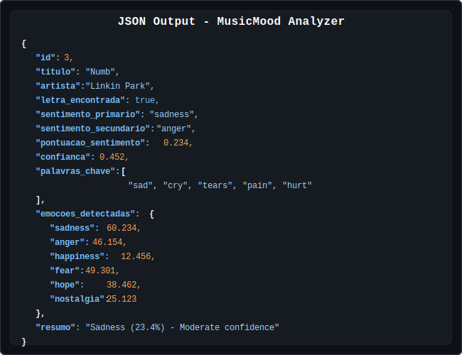

# MusicMood Analyzer

Music Lyrics Sentiment Analysis System that automatically identifies emotions conveyed by song lyrics using natural language processing (NLP).

## Features

- **Automatic lyrics fetching**: Retrieves song lyrics from multiple online sources
- **Advanced sentiment analysis**: Uses NLP to identify predominant emotions
- **Multiple emotion detection**: Identifies primary and secondary sentiments
- **Contextual analysis**: Considers phrase context and intensifying words
- **SQLite database**: Stores results for future queries
- **Command-line interface**: Multiple usage modes (interactive, direct, artist analysis)
- **Artist statistics**: Complete analysis of an artist's emotional profile

## Installation

### Prerequisites

- Python 3.11 or higher
- uv (Python package manager)

### Environment Setup

```bash
# Clone the repository
git clone https://github.com/digomes87/musicmood-analyzer
cd musicmood-analyzer

# Create and activate virtual environment
uv venv .venv
source .venv/bin/activate  # On Windows: .venv\Scripts\activate

# Install dependencies
uv pip install -e .
```

## Usage

### 1. Specific Song Analysis

```bash
# Basic analysis
python main.py "Numb" "Linkin Park"

# Force new analysis (ignores cache)
python main.py "Numb" "Linkin Park" --force-refresh

# JSON format output
python main.py "Numb" "Linkin Park" --json
```

**Example output:**


*Detailed analysis showing primary sentiment (Sadness), secondary (Anger), confidence score and distribution of detected emotions.*

#### JSON Format

For integration with other applications, use the `--json` flag:



*Structured JSON format containing all analysis data, ideal for programmatic integration and automated processing.*

### 2. Complete Artist Analysis

```bash
# Analysis of all songs by an artist
python main.py --artist "Linkin Park"
```

**Example output:**


*Complete analysis of the artist's emotional profile, showing sentiment distribution, statistics and most representative songs.*

### 3. Interactive Mode

```bash
# Start interactive mode
python main.py --interactive
# or simply
python main.py
```

**Interactive interface:**


*Terminal interface showing the complete interactive mode flow, from option selection to analysis results display.*

## Project Structure

```
musicmood-analyzer/
├── src/
│   ├── __init__.py
│   ├── musicmood.py          # Main system class
│   ├── sentiment_analyzer.py # Sentiment analysis engine
│   ├── lyrics_fetcher.py     # Online lyrics fetcher
│   └── database.py           # SQLite database manager
├── main.py                   # Command-line interface
├── pyproject.toml           # Configuration and dependencies
├── README.md                # This file
└── musicmood.db            # SQLite database (created automatically)
```

## Technologies Used

- **Python 3.11+**: Main language
- **NLTK**: Natural language processing
- **TextBlob**: Sentiment analysis
- **BeautifulSoup4**: Web scraping for lyrics fetching
- **Requests**: HTTP requests
- **SQLite3**: Local database
- **LyricsGenius**: API for lyrics fetching (optional)

## Analysis Algorithm

The system uses a multi-layer approach for sentiment analysis:

### 1. Lexical Analysis
- Emotional keyword dictionaries in Portuguese and English
- Detection of intensifiers ("very", "extremely", etc.)
- Text normalization and cleaning

### 2. Contextual Analysis
- Complete phrase processing
- Semantic context consideration
- Polarity analysis with TextBlob

### 3. Intensity Classification
- Scale from 0.0 to 1.0 for emotional intensity
- Confidence calculation based on multiple factors
- Detection of primary and secondary emotions

### 4. Supported Emotions

- **Sadness**: Melancholy, depression, loneliness
- **Anger**: Frustration, irritation, violence
- **Happiness**: Joy, love, celebration
- **Fear**: Anxiety, insecurity, paranoia
- **Hope**: Optimism, faith, dreams
- **Nostalgia**: Longing, memories, past

## Database

The system uses SQLite to store analyses:

```sql
CREATE TABLE musicas (
    id INTEGER PRIMARY KEY AUTOINCREMENT,
    titulo TEXT NOT NULL,
    artista TEXT NOT NULL,
    letra TEXT NOT NULL,
    sentimento_primario TEXT NOT NULL,
    sentimento_secundario TEXT,
    pontuacao_sentimento REAL NOT NULL,
    palavras_chave TEXT,
    data_analise DATETIME DEFAULT CURRENT_TIMESTAMP,
    UNIQUE(titulo, artista)
);
```

## Programmatic Usage Examples

```python
from src.musicmood import MusicMoodAnalyzer

# Create analyzer instance
with MusicMoodAnalyzer() as analyzer:
    # Analyze a song
    result = analyzer.analyze_song("Numb", "Linkin Park")
    print(f"Sentiment: {result['sentimento_primario']}")
    print(f"Confidence: {result['confianca']:.2f}")
    
    # Analyze complete artist
    artist_analysis = analyzer.get_artist_analysis("Linkin Park")
    print(f"Total songs: {artist_analysis['total_musicas']}")
    
    # Compare multiple songs
    comparison = analyzer.compare_songs([
        ("Numb", "Linkin Park"),
        ("Happy", "Pharrell Williams"),
        ("Hurt", "Johnny Cash")
    ])
    print(f"Most positive: {comparison['mais_positiva']['titulo']}")
```

## Development

### Branch Structure

The project is organized in thematic branches:

- `main`: Main branch with stable code
- `feature/nlp-processing`: Natural language processing
- `feature/keyword-emotions`: Emotional keyword system
- `feature/context-analysis`: Contextual phrase analysis
- `feature/intensity-scale`: Intensity classification
- `feature/multi-emotions`: Multiple emotion detection

### Contributing

1. Fork the project
2. Create a feature branch (`git checkout -b feature/new-feature`)
3. Commit your changes (`git commit -am 'Add new feature'`)
4. Push to the branch (`git push origin feature/new-feature`)
5. Open a Pull Request

## Limitations and Considerations

- **External source dependency**: Lyrics fetching depends on third-party websites
- **Languages**: Optimized for Portuguese and English
- **Cultural context**: May not capture specific cultural nuances
- **Complex metaphors**: Highly figurative language may be misinterpreted
- **Rate limiting**: Respects request limits from lyrics websites

## Roadmap

- [ ] Support for more languages
- [ ] Integration with streaming APIs (Spotify, Apple Music)
- [ ] Web interface with visualizations
- [ ] Complete album analysis
- [ ] Machine learning to improve accuracy
- [ ] PDF report export
- [ ] REST API for integration

## License

This project is licensed under the MIT License - see the [LICENSE](LICENSE) file for details.

## Author
Diego Go

Developed as part of a musical analysis project using natural language processing techniques.

## Acknowledgments

- NLTK community for the excellent NLP framework
- TextBlob developers for simplicity in sentiment analysis
- Lyrics websites that make content publicly available
- Initial inspiration based on Linkin Park lyrics analysis